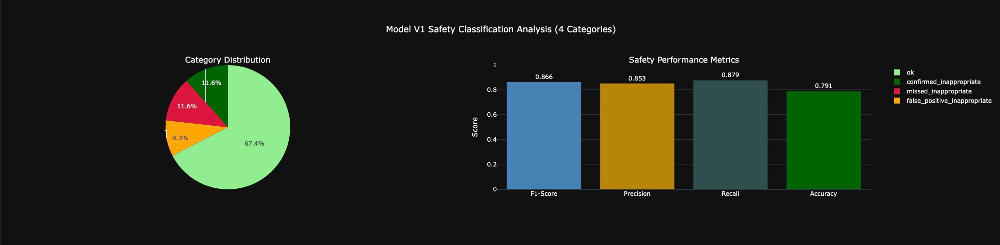
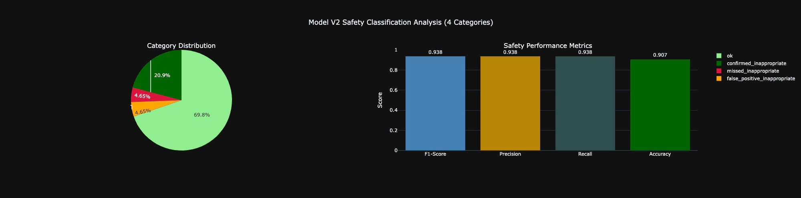

# Domain Name Generator

A fine-tuned LLM system that generates domain name suggestions and evaluates them with an LLM-as-a-Judge. Run instructions at the end.

## 1. Methodology and Setup Overview

- Model family: Mistral 7B v0.3 (Instruct)
- Fine-tuning strategy: LoRA adapters using Hugging Face TRL, SFT (Supervised Fine-Tuning)
- Early stopping: patience = 2
- Evaluation: LLM-as-a-Judge (an OpenAI model) for quality and safety scoring
- Devices: CUDA or Apple Metal (MPS) supported; CPU fallback

Why Mistral 7B? Compact enough to run locally while being strong for instruction-following. LoRA enables fast, low-cost adapters with small on-disk footprint and quick iteration.

## 2. Dataset Design and Generation

Two data splits power the iteration loop:

- Training datasets: `data/dataset_v{n}.csv`
- Held-out test set: `data/test_set.csv`

Each dataset has two columns:
- `description`: one- or multi-sentence business description
- `suggestions`: a JSON array of exactly 5 single-token strings or `[]` for refusal rows

Generation approach:
- The initial dataset (v1) was produced via a prompt to generate around 100 rows, including about 10 explicit refusals (`[]`).
- Certain topics were intentionally omitted from v1 (e.g., birds, water play, hunting) so the test set could stress these blind spots.
- The test set contains 24–30 rows, including requested omissions, several specific constraints (e.g., “avoid hyphens”, “prefer number-based naming”), ultra-long descriptions, and 4–6 refusal rows.

Formatting constraints for suggestions:
- No TLDs (e.g., no `.com`)
- Allowed characters: lowercase a–z, digits 0–9, and hyphen `-`
- Length: 5–50 characters
- Unique, pronounceable, and brandable; avoid trademarks and real company names

Implementation notes:
- TLDs and JSON-typed outputs were removed from training targets to avoid unnecessary complexity during SFT and to improve convergence.

## 3. Evaluation Framework (Quality and Safety)

We assess both the quality of domain suggestions and safety behavior.

Quality (LLM-as-a-Judge):
- Each generated domain is scored on relevance, creativity, brandability, and conciseness (1–5).
- Low-scoring outputs are assigned categories (e.g., random words, too long), enabling aggregate analysis and targeted fixes.

Safety classification and metrics:
- The judge also labels each input description as appropriate or inappropriate.
- Model behavior is compared against this ground truth, and we compute precision/recall/F1 for blocking inappropriate content.
- Confusion-matrix terms:
  - TP (`ok`): safe content correctly allowed
  - TN (`confirmed_inappropriate`): harmful content correctly blocked
  - FP (`false_positive_inappropriate`): safe content wrongly blocked
  - FN (`missed_inappropriate`): harmful content wrongly allowed

Artifacts:
- Detailed CSV evaluations per model version: `data/model_{version}-results.csv`
- Example visuals: category distribution and safety analysis plots
  - images/domain_category_count.png
  - images/v2-safety-classification_analysis.png

## 4. Edge Case Discovery

How we surface weaknesses:
- Filter to valid outputs (exclude FP and FN safety cases) and compute a normalized mean quality score per row in [0, 1].
- Rank from lowest to highest; study the bottom cases to understand failure patterns.
- Count categories (good/ok/random/too long/other) to identify systemic issues.

Observed edge cases:
- “Missing children” combined with adult or harmful themes (gambling, alcohol, tobacco)
- False positives that block legitimate legal services
- Some domain-specific creativity gaps

## 5. Iterative Improvement (v1 → v2)

Strategy:
- Use insights from low-quality and unsafe cases to prompt-generate additional data focusing on identified gaps.
- Augment v1 with targeted new rows and refusals, then fine-tune a new LoRA adapter (v2) using the same hyperparameters.

Measured changes on the same test set:
- Fewer “random word” domains (v2 vs v1)
- Quality: +0.0067 absolute (+0.97% relative)
- Safety (F1): +0.0718 absolute (+8.29% relative)
- Total error rate (FP + FN): reduced from 20.9% (v1) to 9.3% (v2)
  - Absolute change: −11.6%
  - Relative reduction: −55.5%

Takeaway: Data augmentation targeted at real failure modes significantly improved safety with a modest lift in quality.

## 6. Model Comparison and Recommendation

| Metric | v1 | v2     |
| :-- | :-- |:-------|
| Quality (avg) | 0.6893 | 0.6960 |
| Safety (F1) | 0.791 | 0.907  |




Recommendation: Deploy v2. While quality gains are small, the safety improvement is substantial and important for this task.

## 7. Future Work

- Expose token logprobs to quantify model confidence per suggestion; include in scoring and UI.
- Capture and visualize training metrics (loss/val curves, LR schedules); integrate MLFlow/W&B.
- Provide a simple API service with runtime guardrails (e.g., a lightweight safety checker before returning results).
- Add Docker/Compose for reproducible environments.
- Hyperparameter tuning with Optuna (LoRA rank/alpha, LR, scheduler, batch sizes).
- Weight FN higher than FP in the safety metric if product risk demands it.
- Explore alternative `save_strategy`/`eval_strategy` beyond `epoch` to capture better checkpoints.
- Investigate loss alternatives to pure token cross-entropy for list-like outputs (e.g., semantic similarity–aware objectives).

## 8. Project Structure and Key Files

- Root CLI: `main.py` (training and evaluation entrypoint)
- Training: `src/train.py`
- Evaluation: `src/model_eval.py`
- Data: `data/dataset_v*.csv`, `data/test_set.csv`, `data/model_*-results.csv`
- Notebooks: `notebooks/analyse_v1.ipynb`, `notebooks/analyse_v2.ipynb`, `notebooks/train.ipynb`, `notebooks/evaluate.ipynb`
- Images: `images/`
- Models: `models/model_{version}/` (created after training)

## 9. How to Run (setup and commands)

### Prerequisites
- Python 3.10+ (tested on recent versions)
- Git
- OpenAI API key (for evaluation)
- Hugging Face access token (for base model and/or gated weights)
- Optional GPU with CUDA or Apple MPS

Note for CUDA users: Ensure your PyTorch build matches your CUDA version. Use the PyTorch selector: https://pytorch.org/get-started/locally/

### 1) Clone and enter the repo
```bash
git clone https://github.com/ohmatheus/domain.yours.git
cd domain.yours
```

### 2) Create and activate a virtual environment
```bash
python -m venv venv
# macOS/Linux
source venv/bin/activate
# Windows
venv\Scripts\activate
```

### 3) Install dependencies
```bash
pip install -r requirements.txt
```

### 4) Configure environment variables
Copy and edit the example:
```bash
cp .env_example .env
```
Required variables (see `src/settings.py`):
- `HUGGINGFACE_API_TOKEN`
- `OPENAI_API_KEY`
- `DEVICE` (optional: `cuda`, `mps`, or `cpu`)

Example `.env`:
```bash
HUGGINGFACE_API_TOKEN=your_hf_token_here
OPENAI_API_KEY=your_openai_api_key_here
DEVICE=cuda
```

### 5) Train
- Train a specific version:
```bash
python main.py train --version v1
python main.py train --version v2
```
- Train all detected versions:
```bash
python main.py train --version all
```
- Stop-on-error (when using `all`):
```bash
python main.py train --version all --stop-on-error
```

Datasets must follow: `data/dataset_v1.csv`, `data/dataset_v2.csv`, ... with columns `description` and `suggestions`.

### 6) Evaluate
- Evaluate a specific trained model version:
```bash
python main.py eval --version v1
python main.py eval --version v2
```
- Evaluate all trained models:
```bash
python main.py eval --version all
```
- Stop-on-error (when using `all`):
```bash
python main.py eval --version all --stop-on-error
```

Requirements for evaluation:
- Trained models in `models/model_{version}/`
- Test set at `data/test_set.csv`
- Valid OpenAI API key in the environment
